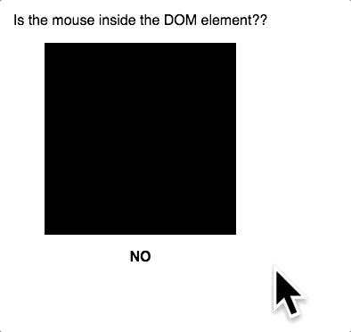

# is-inside-dom-element

>

[](https://www.npmjs.com/package/is-inside-dom-element) [](https://standardjs.com)





## Description

Sometimes you need programmatic way to determine whether the mouse cursor is hovering above a DOM element. Instead of using <code>onmouseover</code> or <code>onmouseleave</code> this lib uses geometry to determine this.

It's a rudimentary implementation since it only works on rectangular DOM elements.

## Demo

https://wle8300.github.io/is-inside-dom-element

## Install

```bash
npm install --save is-inside-dom-element
```

## Usage

```
//calling
import isInside from 'is-inside-dom-element'

//usage
document.addEventListener('mousemove', (event) => {

  const element = document.getElementById('some-id')

  console.log(isInside(event.x, event.y, element))
})
```

## License

MIT © [wle8300](https://github.com/wle8300)
